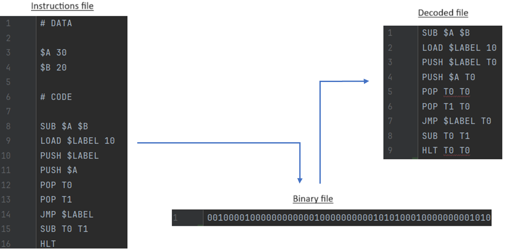
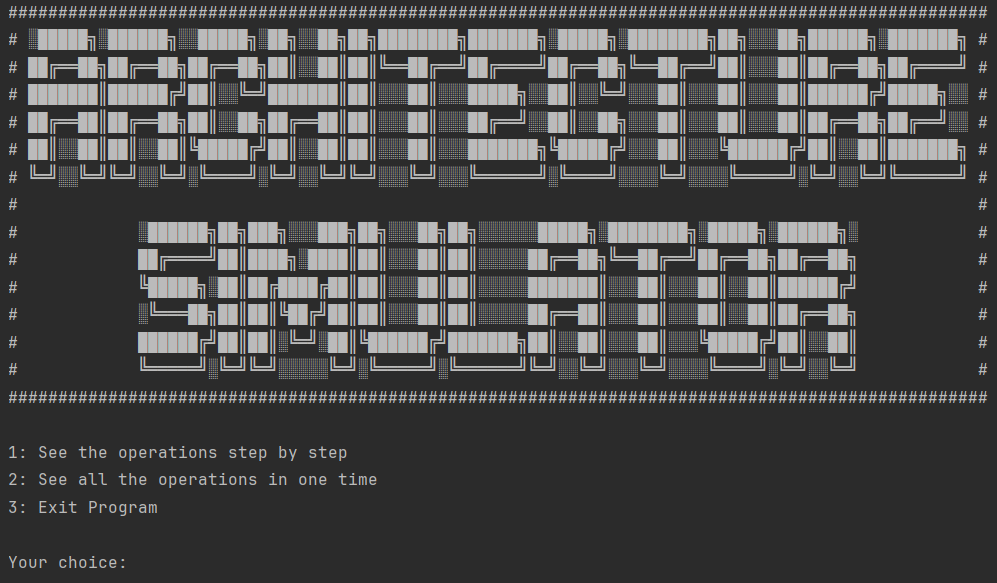
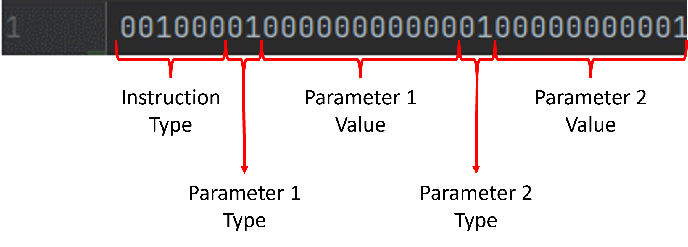

# Final Assignment: Architecture Simulator
## Discipline : Computer Architecture

### Description

The goal of this project is to simulate the execution of a program in assembly on a processor.\
The program will read a file in pseudo-binary `binaryFile.txt` (binary architecture chosen by us) 
to simulate as closely as possible the execution of a program in the processor.\
For greater readability and ease of use, instructions are first written in assembly language and 
composed of a set of instructions (`instructionFile.txt`), then translated into pseudo-binary `binaryFile.txt`.\
After that the program will read the pseudo-binary file and decode it to store the instructions in `decodeFile.txt`.\
The architecture of our program is composed of a set of components (registers, memory, logical function, etc.).

#### Coding and decoding assembly instruction

### Architecture
#### Home menu

#### Assembly language

The program contains 4 registers `T0`, `T1`, `T2`, `T3`.\
The architecture of the `#code` part in assembly file is composed of 3 "columns".\
First there's the instruction, then a register/variable/constant and finally a second register/variable/constant.\
The program will read the instruction and execute it with the two registers/variables/constants.\
The `#data` part is composed of a set of variables and constants.

#### Organization of the bit encoding on 32 bits

#### All the assembly operation performed
1. LDA (reg1) (reg2)/(var)/(const)
   - Load register reg1 with the contents of either the contents of reg2, or the memory var or a constant 
   const.
2. STR (var) (reg)/(const)
   - Store in the memory position referred by var the value of register reg or a constant const.
3. PUSH (reg)/(var)/(const)
   - Push to the top of the stack the contents of reg or var or a constant const.
4. POP (reg)
   - Pop from the top of the stack and store the value on reg.
5. AND (reg1) (reg2)/(var)/(const)
   - Performs a logical AND operation between reg1 and a register reg2, a variable var or a constant 
   const, and store the result on register reg1.
6. OR (reg1) (reg2)/(var)/(const)
   - Performs a logical OR operation between reg1 and a register reg2, a variable var or a constant 
   const, and store the result on register reg1.
7. NOT (reg)
   - Performs a logical NOT operation on register reg and store the result on register reg.
8. ADD (reg1) (reg2)/(var)/(const)
   - Performs the addition operation of reg1 and a register reg2, a variable var or a constant const, and 
   store the result on register reg1.
9. SUB (reg1) (reg2)/(var)/(const)
   - Performs the subtraction operation of reg1 and a register reg2, a variable var or a constant const, 
   and store the result on register reg1. The operation is given by second argument minus the first 
   argument (i.e., reg2 – reg1).
10. DIV (reg1) (reg2)/(var)(const)
    - Performs the integer division operation of reg1 and a register reg2, a variable var or a constant 
    const, and store the result on register reg1. The operation is given by second argument divided by
    the first argument (i.e., reg2 / reg1).
11. MUL (reg1) (reg2)/(var)/(const)
    - Performs the integer multiplication operation of reg1 and a register reg2, a variable var or a 
    constant const, and store the result on register reg1.
12. MOD (reg1) (reg2)/(var)/(const).
    - Performs the integer modulo operation of reg1 and a register reg2, a variable var or a constant 
    const, and store the result on register reg1. The operation is given by second argument modulo the 
    first argument (i.e., reg2 mod reg1).
13. INC (reg)
    - Increments the value of a register reg.
14. DEC (reg)
    - Decrements the value of a register reg.
15. BEQ (reg1)/(var1)/(const1) (reg2)/(var2)/(const2) (LABEL)
    - Performs a comparison between two values, given by registers, variables or constants. Any 
    combination is permitted. If they are equal, jump to the address defined by the label LABEL.
16. BNE (reg1)/(var1)/(const1) (reg2)/(var2)/(const2) (LABEL)
    - Performs a comparison between two values, given by registers, variables or constants. Any 
    combination is permitted. If they are different, jump to the address defined by the label LABEL.
17. BBG (reg1)/(var1)/(const1) (reg2)/(var2)/(const2) (LABEL)
    - Performs a comparison between two values, given by registers, variables or constants. Any 
    combination is permitted. If the first parameter is bigger than the second parameter, jump to the 
    address defined by the label LABEL.
18. BSM (reg1)/(var1)/(const1) (reg2)/(var2)/(const2) (LABEL)
    - Performs a comparison between two values, given by registers, variables or constants. Any 
    combination is permitted. If the first parameter is smaller than the second parameter, jump to the 
    address defined by the label LABEL.
19. JMP (LABEL)
    - Jump to the address defined by the label LABEL.
20. HLT
    - End the program execution.
21 (Bonus). LOAD
    - Load the value of a var, reg or const into a variable var.

# Authors

#### Concordia University & EFREI - L3 - S5 - Promo 2026

[Tom DIZDAREVIC](https://github.com/tom-diz)\
[Thibaut MENIN](https://github.com/Pulsar94)

# Use

To run the project, you need to have `>= Python 3.11` and the package `keyboard`. You can install this package with the command `pip install keyboard`.\
To start the program, you need to run the `Main.py` file.
